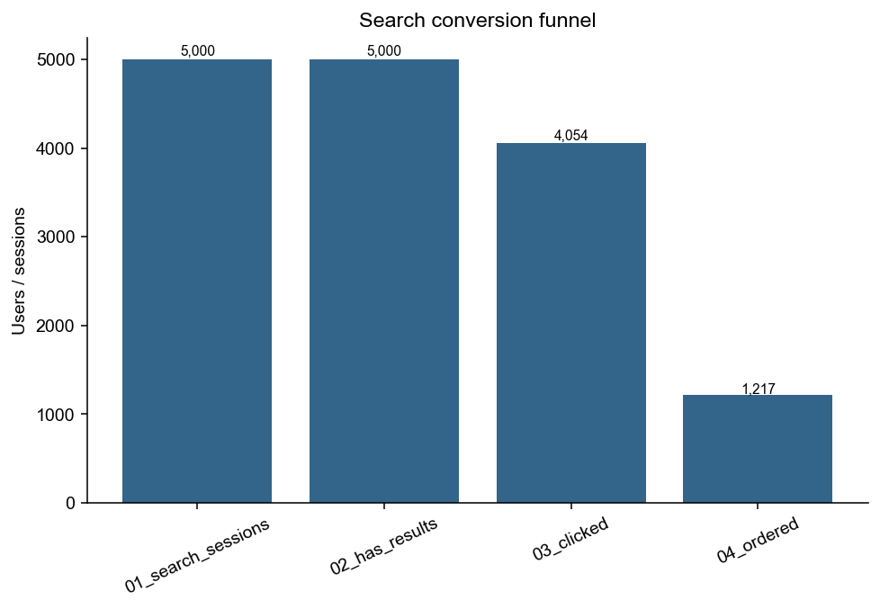
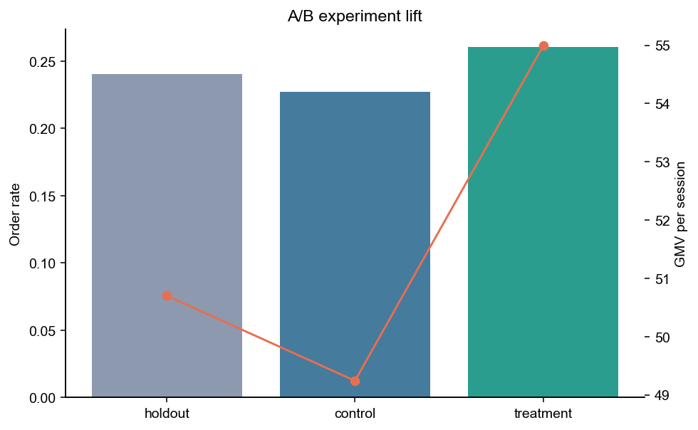
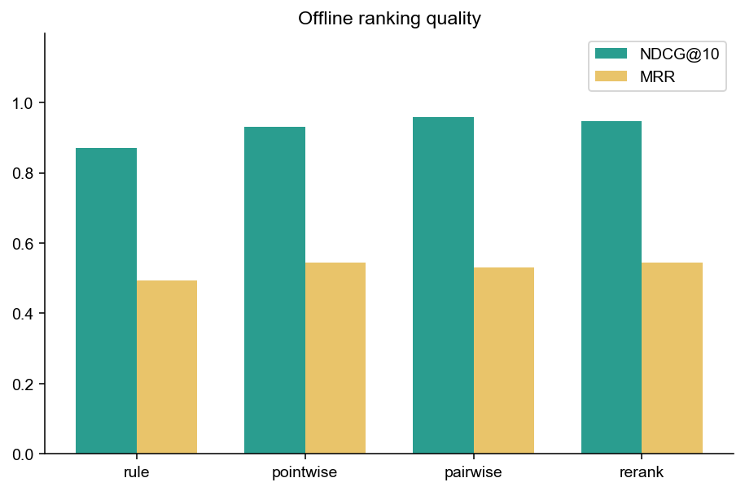
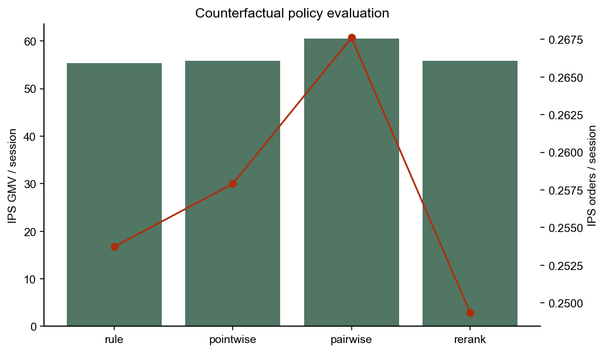
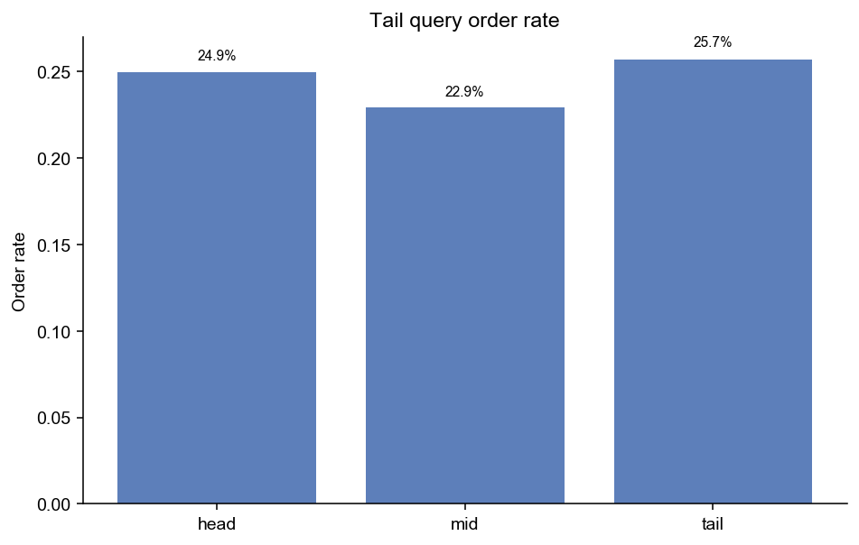
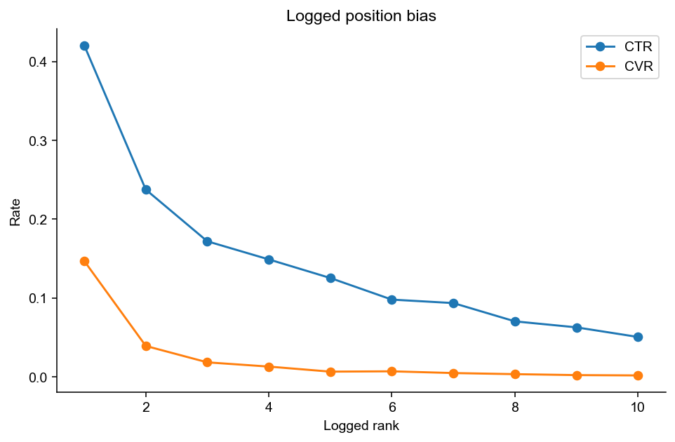
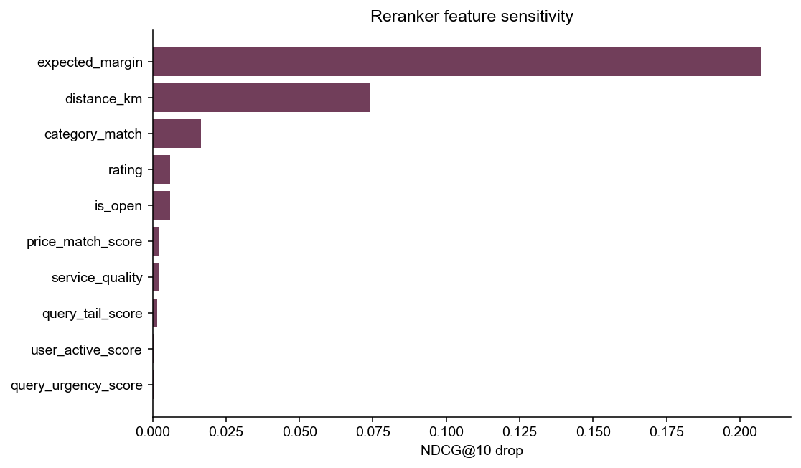
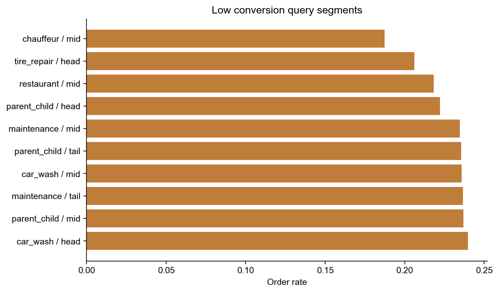

# 本地生活搜索排序、转化预估与反事实评估报告

## 0. 项目说明

本项目使用完全合成的本地生活搜索日志，模拟 query、候选商家、曝光位置、点击、下单、收入和实验分组。项目不包含线下真实主体、精确地理坐标、真实成交记录或个人信息。

## 1. Executive Summary

- ML reranker 的 NDCG@10 相比规则 baseline 提升 8.9%。
- treatment 实验组相对 control 的下单率提升 3.38%。
- pointwise 点击 AUC 为 0.728，订单 AUC 为 0.862。
- IPS 反事实评估下，rerank top3 GMV/session 为 55.81。

## 2. 搜索转化漏斗

| stage | users | rate_of_sessions | step_rate |
| --- | --- | --- | --- |
| 01_search_sessions | 5,000 | 1.00 |  |
| 02_has_results | 5,000 | 1.00 | 1.00 |
| 03_clicked | 4,054 | 81.08% | 81.08% |
| 04_ordered | 1,217 | 24.34% | 30.02% |

## 3. 实验与真实业务 Lift

| variant | sessions | click_rate | order_rate | gross_revenue | gross_margin | gmv_per_session | margin_per_session |
| --- | --- | --- | --- | --- | --- | --- | --- |
| holdout | 707 | 80.34% | 24.05% | 35,848 | 11,863 | 50.70 | 16.78 |
| control | 2,150 | 79.77% | 22.70% | 105,857 | 34,950 | 49.24 | 16.26 |
| treatment | 2,143 | 82.64% | 26.08% | 117,842 | 39,124 | 54.99 | 18.26 |

## 4. 排序模型效果

| model | ndcg@5 | ndcg@10 | map@10 | mrr |
| --- | --- | --- | --- | --- |
| rule | 76.63% | 86.99% | 43.40% | 49.44% |
| pointwise | 88.15% | 93.02% | 47.70% | 54.41% |
| pairwise | 93.72% | 95.74% | 46.71% | 52.97% |
| rerank | 91.14% | 94.70% | 47.68% | 54.53% |
| logged | 84.00% | 91.09% | 47.65% | 54.04% |

这个项目把排序拆成规则 baseline、pointwise CTR/CVR、pairwise ranker 和多目标 reranker。面试讲述重点是：模型不是只追求 AUC，而是要看 NDCG、MRR、GMV、长尾 query 和反事实评估。

## 5. IPS 反事实评估

| model | ips_clicks_per_session | ips_orders_per_session | ips_gmv_per_session | ips_margin_per_session |
| --- | --- | --- | --- | --- |
| rule | 1.15 | 25.37% | 55.32 | 18.31 |
| pointwise | 1.23 | 25.79% | 55.82 | 18.62 |
| pairwise | 1.29 | 26.76% | 60.57 | 20.24 |
| rerank | 1.27 | 24.93% | 55.81 | 18.57 |
| logged | 1.19 | 26.04% | 54.21 | 17.95 |

IPS 使用曝光位置 propensity 对历史日志做校正，用来回答“如果把新排序策略放到同一批流量上，预期点击、订单和 GMV 会怎样”。它仍然是离线估计，上线前需要小流量 A/B 验证。

## 6. 长尾 Query 与位置偏差

| tail_type | sessions | impressions | impression_ctr | impression_order_rate | session_click_rate | order_rate | category_match_rate | avg_distance_km |
| --- | --- | --- | --- | --- | --- | --- | --- | --- |
| head | 1,647 | 16,470 | 15.07% | 2.50% | 81.42% | 24.95% | 74.64% | 8.30 |
| mid | 2,031 | 20,310 | 14.84% | 2.29% | 81.68% | 22.94% | 74.91% | 8.33 |
| tail | 1,322 | 13,220 | 14.41% | 2.57% | 79.73% | 25.72% | 74.92% | 8.35 |

| logged_rank | impressions | click_rate | order_rate | avg_logged_propensity | gross_revenue |
| --- | --- | --- | --- | --- | --- |
| 1 | 5,000 | 42.06% | 14.70% | 93.16% | 156,990 |
| 2 | 5,000 | 23.76% | 3.92% | 58.78% | 38,822 |
| 3 | 5,000 | 17.20% | 1.84% | 46.58% | 17,959 |
| 4 | 5,000 | 14.90% | 1.30% | 40.12% | 16,297 |
| 5 | 5,000 | 12.54% | 0.66% | 36.04% | 7,272 |
| 6 | 5,000 | 9.80% | 0.70% | 33.18% | 8,651 |
| 7 | 5,000 | 9.36% | 0.48% | 31.05% | 5,085 |
| 8 | 5,000 | 7.04% | 0.34% | 29.39% | 4,346 |
| 9 | 5,000 | 6.28% | 0.22% | 28.04% | 2,527 |
| 10 | 5,000 | 5.06% | 0.18% | 26.93% | 1,597 |

## 7. 特征解释与 Bad Case

| intent_category | tail_type | sessions | order_rate | category_match_rate | avg_distance_km | avg_capacity_score | gross_revenue |
| --- | --- | --- | --- | --- | --- | --- | --- |
| chauffeur | mid | 256 | 18.75% | 75.66% | 8.52 | 59.96% | 9,862 |
| tire_repair | head | 233 | 20.60% | 75.06% | 8.25 | 62.30% | 7,242 |
| restaurant | mid | 426 | 21.83% | 74.37% | 8.30 | 61.16% | 15,345 |
| parent_child | head | 234 | 22.22% | 74.70% | 8.40 | 60.10% | 11,687 |
| maintenance | mid | 409 | 23.47% | 74.50% | 8.37 | 63.35% | 41,828 |
| parent_child | tail | 242 | 23.55% | 74.59% | 8.37 | 60.76% | 11,290 |
| car_wash | mid | 352 | 23.58% | 74.74% | 8.24 | 61.51% | 6,776 |
| maintenance | tail | 283 | 23.67% | 75.27% | 8.36 | 63.76% | 27,688 |
| parent_child | mid | 270 | 23.70% | 74.96% | 8.35 | 60.19% | 14,000 |
| car_wash | head | 271 | 23.99% | 74.98% | 8.39 | 61.06% | 5,325 |

## 8. 上线 Guardrail

- 不只看 overall NDCG，要按 query intent、tail type、城市层级、商家品类拆分。
- 新策略必须监控零结果、服务距离、商家集中度、低供给 query 和退款风险。
- 归因和 IPS 只是上线前判断，最终增量必须用 holdout/control/treatment 小流量实验确认。
